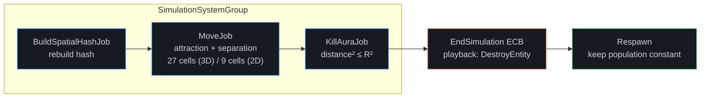

<div align="center">

# Horde Swarm — DOTS Benchmark

**Mass-entity simulation in Unity DOTS: spatial-hash separation, Burst jobs, EntityCommandBuffer.**<br/>
<sub>My first DOTS project, documented as a measurement log: change → profiler → result.</sub>

<br/>


</div>

---

## Demo

> *Demo capture coming soon (Standalone Player build, 100k entities).*

## TL;DR

- **What:** High-performance flocking and horde simulation in Unity 6 DOTS (Entities 1.0, Burst, URP BatchRendererGroup) utilizing a custom spatial hash grid, position-based dynamics (PBD) separation, and zero-allocation continuous spawn/destroy cycles.
- **Study 1 (swarm):** Scaled from 10k to 100k dynamic entities on an Intel Core i5-8400. 100k entities achieve a median frame time of **11.23 ms (~89.1 FPS)** in Render mode (**8.18 ms** No-Render) with 2D spatial hashing, maintaining **strictly 0 B GC allocations** and a rock-solid **3.1 MB managed heap**.
- **Study 2 (straight-line movement):** Controlled baseline comparing the computational cost of moving 100k objects across four architectural approaches (Classic GameObjects Update, Job System Transforms, hierarchical common parent translation, and DOTS Pure ECS `IJobEntity`).
- **How it was measured:** Automated standalone player builds with rendering enabled and disabled, 10s warm-up, and 30s sampling window logged to CSV (see [Methodology](#methodology)).

> [!IMPORTANT]
> **Scope of the comparison.** This is a personal learning project.
> - **Study 2** is the controlled one: identical behaviour (move along Z at equal speed), so the numbers compare *mechanisms* for moving N objects.
> - **Study 1** compares *approaches to a task* (a swarm converging without stacking). Box2D's contact solver and my hash-based separation are different mechanisms, so the numbers answer "what does each approach cost for this task", **not** "how many times is ECS faster than GameObjects in general".

## Key metrics

**Render** build, frame time in ms as **median / p99**. Full tables (including No-Render) are in the studies below.

**Study 1 — swarm to target**

| Variant | 10 000 | 50 000 | 100 000 |
|:--|:--:|:--:|:--:|
| A: GO + Box2D | 13.60 / 18.40 | n/m | n/m |
| B: DOTS, 3D scan | 2.74 / 4.63 | 15.99 / 21.47 | 35.68 / 43.45 |
| C: DOTS, 2D scan | 1.99 / 4.86 | 5.51 / 7.65 | 11.23 / 14.81 |

**Study 2 — straight-line movement (100k entities stress-test)**

| Variant | 100 000 |
|:--|:--:|
| A: GO, Update | 47.79 / 50.88 |
| B: GO, Jobs | 26.04 / 29.60 |
| C: GO, move common parent | 8.27 / 10.25 |
| D: DOTS, IJobEntity | 5.30 / 8.50 |

---

## Methodology

> [!NOTE]
> **Render / No-Render.** Every configuration is built and measured twice. **Render** is the full frame (what the player sees). **No-Render** has the renderers disabled and isolates simulation and transform cost from draw cost, which differs between GameObjects (`MeshRenderer`) and Entities Graphics.

| Item | Value |
|:--|:--|
| Hardware | Intel Core i5-8400 (6C / 6T @ 2.80 GHz) / Discrete GPU / 16 GB DDR4 |
| Unity / Entities | 6000.6.3f1 / 6.6.0 (Entities Graphics, URP 17.6.0) |
| Scene | Orthographic camera, unlit cube mesh, zero Post-Processing overhead |
| Spawn | Uniform distribution across XY plane |
| Warm-up / sample window | 10 s warm-up / 30 s sampling window (`FrameTimeLogger`) |
| Runs per cell | 30 s continuous window (~800 – 14,000+ logged frames per run) |
| Frame time | per-frame duration (`Time.unscaledDeltaTime`) logged to CSV, see `Assets/Scripts/FrameTimeLogger.cs` |
| Median | 50th percentile of per-frame times |
| p99 | 99th percentile of per-frame times (Excel `PERCENTILE.INC`): 99% of frames are faster than this value |
| Other metrics | GC alloc (Profile Analyzer), Native Memory / Managed Heap (Memory Profiler) |

---

# Study 1 — Swarm to target (separation)

## Variants

| ID | Variant | Movement to target | Separation / neighbour search |
|:--:|:--|:--|:--|
| **A** | GameObjects | `Rigidbody2D` + `BoxCollider2D`, velocity toward target | Box2D contact solver |
| **B** | DOTS, 3D scan | Burst `MoveJob` | `NativeParallelMultiHashMap` hash, **27** neighbour cells |
| **C** | DOTS, 2D scan | Burst `MoveJob` | same hash, **9** neighbour cells (motion is planar, Z = 0) |

<details>
<summary><b>Simulation parameters</b></summary>

| Parameter | Value |
|:--|:--|
| `CellSize` | 1.1 |
| `MinSeparationRadius` | 1.1 |
| `MaxNeighboursCount` | 64 |
| Kill aura radius | 5 |

</details>

## Results

"n/m" means not measured, with the reason. Memory is reported as **Native Memory / Managed Heap** (in-use unmanaged memory vs managed C# GC heap).

|      Variant       | Entities |    Render: median / p99     | No-Render: median / p99 | Simulation time | GC alloc | Memory |
| :----------------: | :------: | :-------------------------: | :---------------------: | :-------------: | :------: | :----: |
|  **A** GO + Box2D  |  10 000  |        13.60 / 18.40        |      12.22 / 20.00      |       30        |  236 B   | 256 MB / 5.2 MB |
|  **A** GO + Box2D  |  50 000  |  n/m: 10k already 13.6 ms   |            –            |        –        |    –     |   –    |
|  **A** GO + Box2D  | 100 000  |  n/m: 10k already 13.6 ms   |            –            |        –        |    –     |   –    |
| **B** DOTS 3D scan |  10 000  |         2.74 / 4.63         |       2.13 / 4.43       |       30        |   0 B    | 260 MB / 3.1 MB |
| **B** DOTS 3D scan |  50 000  |        15.99 / 21.47        |      14.40 / 17.45      |       30        |   0 B    | 272 MB / 3.1 MB |
| **B** DOTS 3D scan | 100 000  |        35.68 / 43.45        |      33.26 / 40.91      |       30        |   0 B    | 289 MB / 3.1 MB |
| **C** DOTS 2D scan |  10 000  |         1.99 / 4.86         |       1.64 / 4.22       |       30        |   0 B    | 260 MB / 3.1 MB |
| **C** DOTS 2D scan |  50 000  |         5.51 / 7.65         |       4.09 / 5.01       |       30        |   0 B    | 272 MB / 3.1 MB |
| **C** DOTS 2D scan | 100 000  |        11.23 / 14.81        |       8.18 / 9.61       |       30        |   0 B    | 289 MB / 3.1 MB |

### Profiler captures

| Frame breakdown (GO, 10k) | Memory breakdown (GO, 10k) |
|:--:|:--:|
|  |  |
| <sub>10k GameObjects: Median 13.6 ms (~73 FPS), GC Collect 1.75 ms</sub> | <sub>Managed Heap: 5.2 MB, Native: 256.5 MB, 10 007 GameObjects (70 184 Scene Objects)</sub> |

| Frame breakdown (DOTS, 10k) | Memory breakdown (DOTS, 10k) |
|:--:|:--:|
|  |  |
| <sub>10k entities: Median 2.7 ms (~370 FPS), zero GC Collect</sub> | <sub>Managed Heap: 3.1 MB, Native: 260.1 MB, 7 GameObjects total</sub> |

| Frame breakdown (DOTS, 50k) | Memory breakdown (DOTS, 50k) |
|:--:|:--:|
|  |  |
| <sub>50k entities: Median 7.4 ms (~135 FPS), zero GC Collect</sub> | <sub>Managed Heap: 3.1 MB, Native: 271.8 MB, 7 GameObjects total</sub> |

| Frame breakdown (DOTS, 100k) | Memory breakdown (DOTS, 100k) |
|:--:|:--:|
|  |  |
| <sub>100k entities: Median 15.0 ms (~67 FPS), zero GC Collect</sub> | <sub>Managed Heap: 3.1 MB, Native: 288.8 MB, 7 GameObjects total</sub> |

## Architecture

Order of work inside one frame (DOTS variants):



The simulation loop executes sequentially within `SimulationSystemGroup`. `BuildSpatialHashJob` populates the grid keys in parallel; `MoveJob` consumes this hash to compute flocking attraction and neighbor repulsion forces. Subsequently, `KillAuraJob` schedules entity destruction into `EndSimulationEntityCommandBufferSystem`, which safely executes structural changes at the frame sync point before respawning maintains population equilibrium.

---

# Study 2 — Straight-line movement of N objects

Identical behaviour in all variants: every cube moves along the **Z axis** at the **same speed**. This isolates the cost of the movement mechanism itself.

## Variants

| ID | Variant | How the objects move |
|:--:|:--|:--|
| **A** | GameObjects, `Update` | each cube has a `MonoBehaviour` that moves itself every frame |
| **B** | GameObjects, Jobs | all transforms in a `TransformAccessArray`, moved by one `IJobParallelForTransform` scheduled from a single `Update` |
| **C** | GameObjects, common parent | all cubes are children of one empty parent; only the parent is moved (one `Transform` write per frame, $O(1)$), children are static in local space |
| **D** | DOTS, `IJobEntity` | Burst-compiled `IJobEntity` updating `LocalTransform` components in parallel (`ScheduleParallel`) |

Variant C is compared against variants A and B, where the cubes have no common parent.

> [!NOTE]
> A plain `IJobParallelFor` cannot touch a `Transform`; moving GameObjects from a job needs `IJobParallelForTransform` with a `TransformAccessArray`.

<details>
<summary><b>Controls kept equal across variants</b></summary>

- Same speed, same `deltaTime` usage; the sample window is time-based, so every variant runs under equal duration (30 s continuous window).
- Benchmarked at **100 000 entities stress-test scale** to expose CPU bottlenecks, cache locality limits, and hierarchy overhead.
- Variants A, B, and D: all GameObjects/entities are flat (no parents), the best case for `TransformAccessArray`. Variant C: one empty parent for all cubes.
- Same unlit material and camera setup; SRP Batcher active.
- Dedicated standalone player builds with `FrameTimeLogger` (10 s warm-up, 30 s measurement window).

</details>

## Results

Measurements taken on **100 000 entities** in Standalone Player builds over 30 s sampling windows. Memory metrics captured via Unity Memory Profiler and Profile Analyzer in Render mode.

| Variant | Entities | Render: median / p99 | FPS @ median (1% low) | No-Render: median / p99 | FPS @ median (1% low) | Movement script cost | GC alloc | Memory (Native / Heap) |
|:--:|:--:|:--:|:--:|:--:|:--:|:--:|:--:|:--:|
| **A** GO, Update | 100 000 | 47.79 / 50.88 ms | 20.9 (19.7) | 28.08 / 29.31 ms | 35.6 (34.1) | 42.95 ms | 0 B | 1.65 GB / 78.7 MB |
| **B** GO, Jobs | 100 000 | 26.04 / 29.60 ms | 38.4 (33.8) | 7.39 / 9.04 ms | 135.2 (110.6) | 4.46 ms | 2.8 KB | 1.68 GB / 76.1 MB |
| **C** GO, common parent | 100 000 | 8.27 / 10.25 ms | 121.0 (97.5) | **1.10 / 4.95 ms** | **910.2 (202.2)** | **0.55 ms** | ~1.4 KB | 1.69 GB / 73.9 MB |
| **D** DOTS, `IJobEntity` | 100 000 | **5.30 / 8.50 ms** | **188.8 (117.7)** | 1.85 / 2.85 ms | 539.6 (350.5) | 0.82 ms | 1.3 KB | **1.37 GB / 65.7 MB** |

> [!TIP]
> **Performance Winners:**
> - **Simulation only (No-Render):** **Variant C (Common Parent, 1.10 ms)** wins by executing a single root transform translation ($O(1)$) instead of updating 100,000 entities individually ($O(N)$).
> - **Real-world game frame (Render):** **Variant D (DOTS Pure ECS, 5.30 ms / ~189 FPS)** is the overall winner, outperforming Common Parent by **~1.56x** and classic Update by **~9.0x**.

### Profiler captures

| Frame breakdown (GO Update, 100k) | Memory breakdown (GO Update, 100k) |
|:--:|:--:|
|  |  |
| <sub>100k GameObjects Update: Median 47.8 ms (~21 FPS), Scripts 42.9 ms, BoundingVolumes 47.1 ms</sub> | <sub>Managed Heap: 78.7 MB, Native: 1.65 GB, 100 007 GameObjects (500 579 Scene Objects)</sub> |

| Frame breakdown (GO Jobs, 100k) | Memory breakdown (GO Jobs, 100k) |
|:--:|:--:|
|  |  |
| <sub>100k GameObjects Jobs: Median 26.0 ms (~38 FPS), Scripts 4.46 ms (10x faster execution)</sub> | <sub>Managed Heap: 76.1 MB, Native: 1.68 GB, 100 007 GameObjects (500 587 Scene Objects)</sub> |

| Frame breakdown (GO Common Parent, 100k) | Memory breakdown (GO Common Parent, 100k) |
|:--:|:--:|
|  |  |
| <sub>100k GameObjects Parent: Median 8.27 ms (~121 FPS), Scripts 0.55 ms, BoundingVolumes 23.0 ms</sub> | <sub>Managed Heap: 73.9 MB, Native: 1.69 GB, 100 007 GameObjects (500 603 Scene Objects)</sub> |

| Frame breakdown (DOTS IJobEntity, 100k) | Memory breakdown (DOTS IJobEntity, 100k) |
|:--:|:--:|
|  |  |
| <sub>100k DOTS Entities: Median 5.30 ms (~189 FPS), Scripts 0.82 ms, Zero GameObject overhead</sub> | <sub>Managed Heap: 65.7 MB, Native: 1.37 GB, only 7 GameObjects total (617 Scene Objects)</sub> |

## Deep Architectural Analysis

### 1. The Simulation Illusion ($O(1)$ Parent vs $O(N)$ DOTS in No-Render)
In simulation-only mode (**No-Render**):
- **Variant C (Common Parent)** records **1.10 ms (0.55 ms scripts)**. Moving the parent translates a single root transform in $O(1)$ time. Because rendering is completely disabled, the engine never needs world-space bounds or matrices for the children — their local transforms remain pristine in memory.
- **Variant D (DOTS Pure ECS)** records **1.85 ms (0.82 ms scripts)**. Unlike Common Parent, DOTS is actively doing real work on all 100,000 entities: streaming 100,000 `LocalTransform` components linearly through L1/L2 CPU cache lines and updating positions via SIMD Burst worker threads.

### 2. Why DOTS Dominates the Full Frame (Render mode)
When rendering is enabled (**Render**):
- In **Variant C**, the engine can no longer ignore the children. Even though scripts only take 0.55 ms, Unity's C++ rendering pipeline must evaluate 100,000 individual `MeshRenderer` components. Profiler reveals `UpdateRendererBoundingVolumes` consuming **22.97 ms**, pulling the standalone frame time to **8.27 ms** (121 FPS).
- In **Variant D**, Unity leverages **Entities Graphics & BatchRendererGroup (BRG)**. Instead of traversing a 100k GameObject hierarchy, BRG executes Frustum Culling (`FrustumCullingJob`: 7.26 ms) and GPU uploads (`ExecuteGpuUploads`: 4.03 ms) directly in parallel Burst jobs, pushing transforms directly into GPU constant buffers. DOTS achieves **5.30 ms (188.8 FPS)**.

### 3. Engine Footprint & Memory Hierarchy
- **GameObject Overhead:** Classic GameObjects (Variants A, B, C) instantiate **100,007 GameObjects** and allocate **500,000+ native scene objects** (Transform, MeshFilter, MeshRenderer, etc.), consuming **1.65 – 1.80 GB** of native engine memory and risking 5–8 ms GC spikes.
- **Pure ECS Footprint:** DOTS has only **7 GameObjects** and **617 Scene Objects** total, saving over **300 MB** of native engine memory and achieving rock-solid deterministic frame pacing.

---

> [!IMPORTANT]
> **Limitations and scope:**
> - Study 1 compares distinct architectural paradigms for swarm separation (Box2D iterative solver vs custom DOTS Spatial Hash).
> - Measurements reflect a single reference hardware configuration (Intel Core i5-8400, PC Standalone, D3D12).
> - Classic GameObjects were not measured at 50k and 100k in Study 1 because 10k entities already exceeded the 16.6 ms frame budget (13.6 ms simulation + GC spikes).

<details>
<summary><b>Design decisions</b></summary>

- **Per-frame Spatial Hash rebuild:** Rebuilding the `NativeParallelMultiHashMap` from scratch every frame in parallel via `BuildSpatialHashJob` proved faster and simpler than tracking incremental cell migrations for 100k constantly moving entities.
- **Structural changes via ECB:** Spawning and despawning are deferred to `EndSimulationEntityCommandBufferSystem` to prevent job pipeline stalls and keep parallel worker threads saturated.
- **2D vs 3D Hash Search:** Reducing neighbor checks from 27 cells to 9 planar cells (Z = 0) reduced 100k simulation frame time from 35.68 ms to 11.23 ms (~3.2x speedup).

</details>

---

## Quick start

**Requirements:** Unity `6000.6.3f1`, Entities `6.6.0` (check `Packages/manifest.json`).

```bash
git clone https://github.com/Checoffix/dots-swarm-benchmark.git
```

1. Open the project in Unity Hub.
2. Open the scene for the study you want to run:
   - **Study 1 (DOTS):** `Assets/Scenes/Study1/DOTS_Scene.unity` (with subscene `HordeSubScene.unity`)
   - **Study 1 (GameObjects):** `Assets/Scenes/Study1/GO_Scene.unity`
   - **Study 2 (Movement DOTS):** `Assets/Scenes/Study2/DOTS_Scene.unity` (with subscene `HordeSubScene.unity`)
   - **Study 2 (Movement GameObjects):** `Assets/Scenes/Study2/GO_Scene.unity`
3. **Play** to run in Editor, or **File → Build Settings → Build** for standalone benchmarking with `FrameTimeLogger`.

## About

First DOTS project by [Checoffix](https://github.com/Checoffix). Written as a learning case: every number above comes from my own measurements, and the log shows the mistakes too.
