<div align="center">

# Horde Swarm — DOTS Benchmark

**Mass-entity simulation in Unity DOTS: spatial hash separation, Burst jobs, EntityCommandBuffer.**

<br/>


</div>

---

> [!NOTE]
> **Author's note:** This is my first project exploring Unity DOTS. I am a CS student, and this repository is documented as a practical learning log: change in code → profiler measurement → result.

## Demo

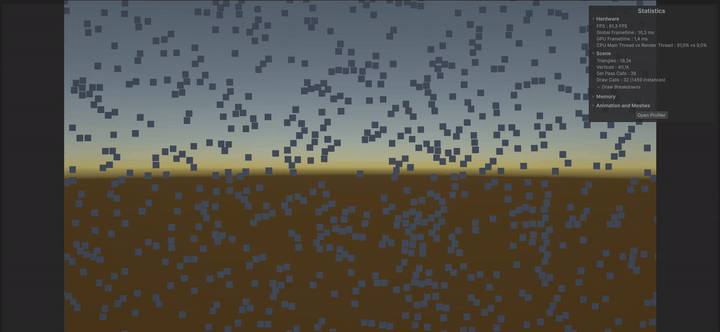

## TL;DR

- **What:** Benchmark testing mass-entity behavior in Unity 6 (Entities 6.6.0, Entities Graphics, Burst, URP). It covers two scenarios: swarm movement with neighbor separation, and straight-line movement.
- **Study 1 (swarm to target):** Scaled from 10k to 100k dynamic entities. With a 2D spatial hash grid, 100k entities run at a median frame time of **11.23 ms (~89.1 FPS)** in Render mode (**8.18 ms** No-Render) in standalone builds. No GC allocations occur during steady-state simulation (0 B per frame), with managed heap staying at 3.1 MB.
- **Study 2 (straight-line movement):** A stress-test with 100k cubes comparing four movement mechanisms (classic MonoBehaviour `Update`, C# Job System with transforms, moving a common parent, and DOTS `IJobEntity`). With rendering enabled, DOTS achieves **5.30 ms (~188.8 FPS)** compared to **8.27 ms** for common parent and **47.79 ms** for classic `Update`.
- **How it was measured:** Standalone player builds logging per-frame deltas via `FrameTimeLogger` to CSV over a 30 s measurement window following a 10 s warm-up (both with rendering enabled and disabled).

> [!NOTE]
> **Scope of the comparison:**
> - **Study 2** is a controlled test: identical straight-line movement along Z at equal speed to compare specific movement mechanisms for 100k objects.
> - **Study 1** compares two different approaches to the same task: Box2D iterative contact solving versus custom spatial hash separation. It evaluates the performance cost of each approach, rather than claiming a general ECS vs GameObject speedup.

## Key metrics

Standalone player build with rendering enabled, frame times in ms as **median / p99**.

**Study 1 — Swarm to target (with separation)**

| Variant | 10 000 | 50 000 | 100 000 |
|:--|:--:|:--:|:--:|
| A: GO + Box2D | 13.60 / 18.40 | — | — |
| B: DOTS, 3D search (27 cells) | 2.74 / 4.63 | 15.99 / 21.47 | 35.68 / 43.45 |
| C: DOTS, 2D search (9 cells) | 1.99 / 4.86 | 5.51 / 7.65 | 11.23 / 14.81 |

**Study 2 — Straight-line movement (100k stress-test)**

| Variant | 100 000 |
|:--|:--:|
| A: GO, Update | 47.79 / 50.88 |
| B: GO, Jobs | 26.04 / 29.60 |
| C: GO, common parent | 8.27 / 10.25 |
| D: DOTS, IJobEntity | 5.30 / 8.50 |

---

## Methodology

> [!NOTE]
> **Render and No-Render modes:** Every configuration is built and measured twice.
> - **Render:** Full frame with rendering enabled (in Study 2 most cubes are outside the camera view, so Render mostly measures culling and bounds updates).
> - **No-Render:** Mesh renderers / Entities Graphics disabled, isolating simulation and transform calculation costs from draw call overhead.

| Parameter | Value |
|:--|:--|
| CPU | Intel Core i5-8400 (6C / 6T @ 2.80 GHz) / 16 GB DDR4 |
| GPU / API | NVIDIA GeForce GTX 1660 SUPER (6 GB VRAM) / Direct3D 11 |
| Unity / Entities | 6000.6.3f1 / 6.6.0 (Entities Graphics, URP 17.6.0) |
| Scene setup | Orthographic camera (size: 5, clip planes: 0.3 .. 1000), unlit cube mesh |
| Spawn layout | Uniform distribution across the XY plane |
| Sample window | 10 s warm-up followed by 30 s continuous CSV logging (`FrameTimeLogger`) |
| Sample size | 626 to 23,400+ frames per 30 s run (depending on frame rate) |
| Frame time | Per-frame delta (`Time.unscaledDeltaTime`) recorded to CSV |
| Median | 50th percentile of per-frame times |
| p99 | 99th percentile of per-frame times (Excel `PERCENTILE.INC`) |
| 1% low FPS | Calculated lower bound framerate: `1000 / p99` |
| Profiling tools | Unity Profile Analyzer and Unity Memory Profiler |

---

# Study 1 — Swarm to target (with separation)

## Variants

| ID | Variant | Movement towards target | Separation / neighbor search |
|:--:|:--|:--|:--|
| **A** | GameObjects | `Rigidbody2D` + `BoxCollider2D` | Box2D contact solver |
| **B** | DOTS, 3D search | Burst `MoveJob` | `NativeParallelMultiHashMap`, checks **27** neighboring cells |
| **C** | DOTS, 2D search | Burst `MoveJob` | `NativeParallelMultiHashMap`, checks **9** neighboring cells (planar motion on Z = 0) |

<details>
<summary><b>Simulation parameters</b></summary>

| Parameter | Value |
|:--|:--|
| `CellSize` | 1.1 |
| `MinSeparationRadius` | 1.1 |
| `MaxNeighboursCount` | 64 |
| Kill aura radius | 5 |

</details>

## Results

Measurements from Standalone Player builds over a 30 s sampling window. Memory reported as **Native Memory / Managed Heap**.

| Variant | Entities | Render: median / p99 | No-Render: median / p99 | GC Alloc / frame | Memory (Native / Heap) |
| :---: | :---: | :---: | :---: | :---: | :---: |
| **A** GO + Box2D | 10 000 | 13.60 / 18.40 ms | 12.22 / 20.00 ms | 236 B | 256 MB / 5.2 MB |
| **A** GO + Box2D | 50 000 | — | — | — | — |
| **A** GO + Box2D | 100 000 | — | — | — | — |
| **B** DOTS 3D | 10 000 | 2.74 / 4.63 ms | 2.13 / 4.43 ms | 0 B | 260 MB / 3.1 MB |
| **B** DOTS 3D | 50 000 | 15.99 / 21.47 ms | 14.40 / 17.45 ms | 0 B | 272 MB / 3.1 MB |
| **B** DOTS 3D | 100 000 | 35.68 / 43.45 ms | 33.26 / 40.91 ms | 0 B | 289 MB / 3.1 MB |
| **C** DOTS 2D | 10 000 | 1.99 / 4.86 ms | 1.64 / 4.22 ms | 0 B | 260 MB / 3.1 MB |
| **C** DOTS 2D | 50 000 | 5.51 / 7.65 ms | 4.09 / 5.01 ms | 0 B | 272 MB / 3.1 MB |
| **C** DOTS 2D | 100 000 | **11.23 / 14.81 ms** | **8.18 / 9.61 ms** | 0 B | 289 MB / 3.1 MB |

### Profiler captures (Study 1)

*(Captured in Unity Editor in Profile Analyzer and Memory Profiler for Render mode)*

| Profile Analyzer (Editor) | Memory Profiler (Editor) |
|:--:|:--:|
| 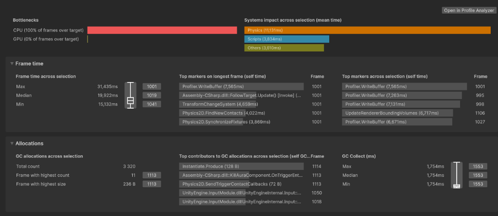 | 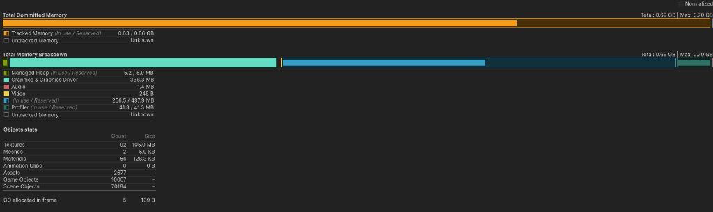 |
| <sub>**A (GO 10k)**: Editor median 13.6 ms, GC Collect pause 1.75 ms</sub> | <sub>Managed Heap: 5.2 MB, Native: 256.5 MB, 10 007 GameObjects (70 184 Scene Objects)</sub> |

| Profile Analyzer (Editor) | Memory Profiler (Editor) |
|:--:|:--:|
| 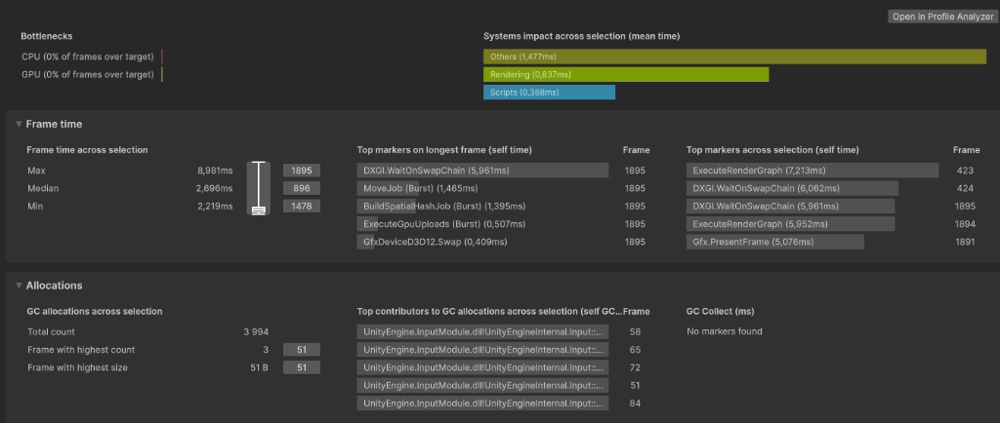 | 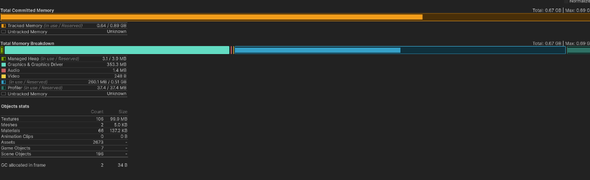 |
| <sub>**C (DOTS 2D 10k)**: Editor median 2.7 ms (Standalone: 1.99 ms), 0 B GC</sub> | <sub>Managed Heap: 3.1 MB, Native: 260.1 MB, 7 GameObjects</sub> |

| Profile Analyzer (Editor) | Memory Profiler (Editor) |
|:--:|:--:|
| 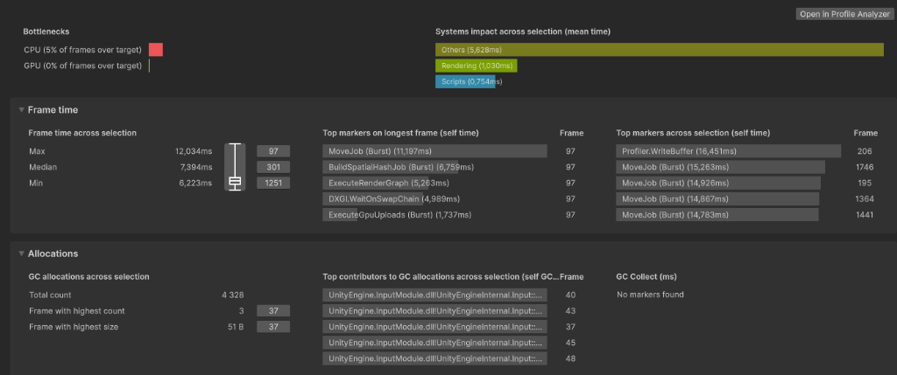 | 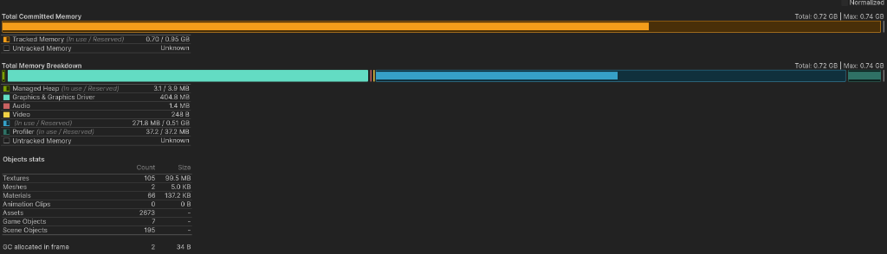 |
| <sub>**C (DOTS 2D 50k)**: Editor median 7.4 ms (Standalone: 5.51 ms), 0 B GC</sub> | <sub>Managed Heap: 3.1 MB, Native: 271.8 MB, 7 GameObjects</sub> |

| Profile Analyzer (Editor) | Memory Profiler (Editor) |
|:--:|:--:|
| 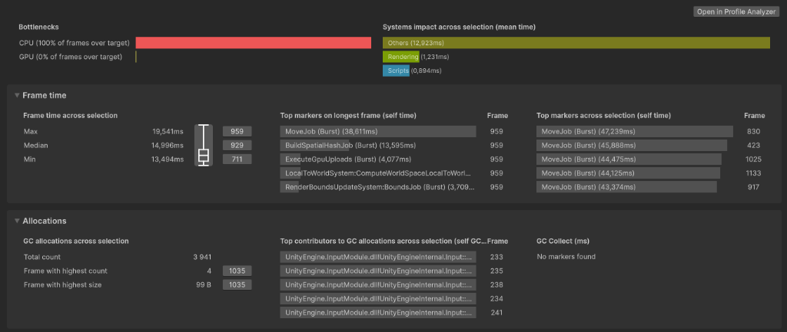 | 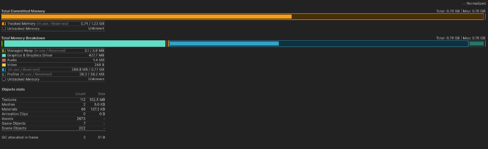 |
| <sub>**C (DOTS 2D 100k)**: Editor median 15.0 ms (Standalone: 11.23 ms), 0 B GC</sub> | <sub>Managed Heap: 3.1 MB, Native: 288.8 MB, 7 GameObjects</sub> |

## Simulation loop architecture

Execution sequence within a frame (DOTS variants):

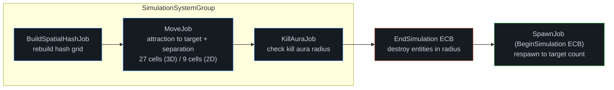

In each frame, `BuildSpatialHashJob` rebuilds the spatial hash grid across worker threads. `MoveJob` samples neighboring cells to apply steering away from nearby entities. `KillAuraJob` flags entities near the target and writes destruction commands to `EndSimulationEntityCommandBufferSystem`. During the next frame, `CubeSpawnerSystem` checks the population deficit and schedules `SpawnJob` via `BeginSimulationEntityCommandBufferSystem` to maintain a constant count.

---

# Study 2 — Straight-line movement of 100 000 objects

All cubes move along the **Z axis** at the same speed (`speed = 5`). The objective is to isolate the performance cost of the movement mechanism itself.

## Variants

| ID | Variant | Movement implementation |
|:--:|:--|:--|
| **A** | GameObjects, Update | Each cube has a `CubeMover` MonoBehaviour calling `transform.position += ...` in `Update()` |
| **B** | GameObjects, Jobs | All cube transforms are registered in a `TransformAccessArray` and updated by an `IJobParallelForTransform` job |
| **C** | GameObjects, common parent | All 100,000 cubes are parented to a single empty GameObject. The script moves only the parent; child local positions remain unchanged |
| **D** | DOTS, `IJobEntity` | Burst-compiled `IJobEntity` updates `LocalTransform` components in parallel via `ScheduleParallel()` |

<details>
<summary><b>Controls kept equal</b></summary>

- Movement speed is identical across all variants (`speed = 5` along Z).
- Objects are spawned across a wide area (`spawnMaxDistance = 1000`), so the camera frustum culls the majority of cubes, directly testing engine culling and bounding volume performance.
- Stress-tested at a fixed scale of **100 000 entities**.
- In variants A, B, and D, objects have no parents (flat hierarchy). In variant C, all cubes share one root parent.
- Same unlit cube mesh, material, and orthographic camera across all variants.
- Measured in dedicated Standalone Player builds using `FrameTimeLogger`.

</details>

## Results

Measurements recorded for **100 000 entities** in Standalone Player builds (30 s window). Memory metrics captured via Unity Memory Profiler and Profile Analyzer in Render mode.

| Variant | Entities | Render: median / p99 | FPS (1% low) | No-Render: median / p99 | FPS (1% low) | Script CPU Time (Editor, Render) | GC Alloc / frame | Editor Memory (Native / Heap)* |
|:--:|:--:|:--:|:--:|:--:|:--:|:--:|:--:|:--:|
| **A** GO, Update | 100 000 | 47.79 / 50.88 ms | 20.9 (19.7) | 28.08 / 29.31 ms | 35.6 (34.1) | 42.95 ms | 0 B | 1.65 GB / 78.7 MB |
| **B** GO, Jobs | 100 000 | 26.04 / 29.60 ms | 38.4 (33.8) | 7.39 / 9.04 ms | 135.2 (110.6) | 4.46 ms | 0 B | 1.68 GB / 76.1 MB |
| **C** GO, common parent | 100 000 | 8.27 / 10.25 ms | 121.0 (97.5) | **1.10 / 4.95 ms** | **910.2 (202.2)** | **0.55 ms** | 0 B | 1.69 GB / 73.9 MB |
| **D** DOTS, `IJobEntity` | 100 000 | **5.30 / 8.50 ms** | **188.8 (117.7)** | 1.85 / 2.85 ms | 539.6 (350.5) | 0.82 ms | 0 B | **1.37 GB / 65.7 MB** |

*\* Notes: All four movement implementations produce 0 B of managed allocations during steady-state simulation (the occasional ~1–3 KB seen in editor profiler snapshots comes from editor systems like the Game View Stats text overlay). Memory figures come from Memory Profiler snapshots in the Editor; compare variants with each other, absolute values include editor overhead.*

### Profiler captures (Study 2)

| Profile Analyzer (CPU) | Memory Profiler (Memory) |
|:--:|:--:|
| 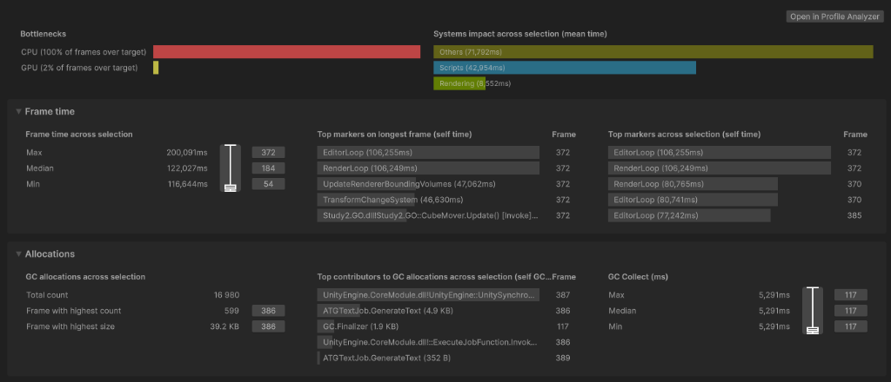 | 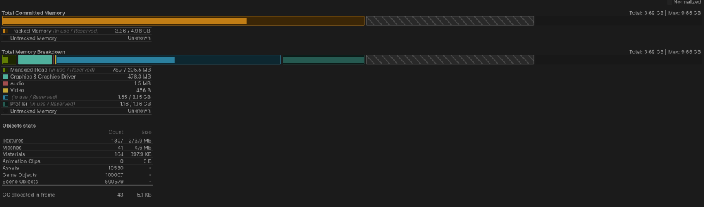 |
| <sub>**A (GO Update)**: Standalone 47.8 ms (~21 FPS) \| Editor median: 122.0 ms, Scripts: 42.95 ms, BoundingVolumes: 47.06 ms</sub> | <sub>Managed Heap: 78.7 MB, Native: 1.65 GB, 100 007 GameObjects (500 579 Scene Objects)</sub> |

| Profile Analyzer (CPU) | Memory Profiler (Memory) |
|:--:|:--:|
| 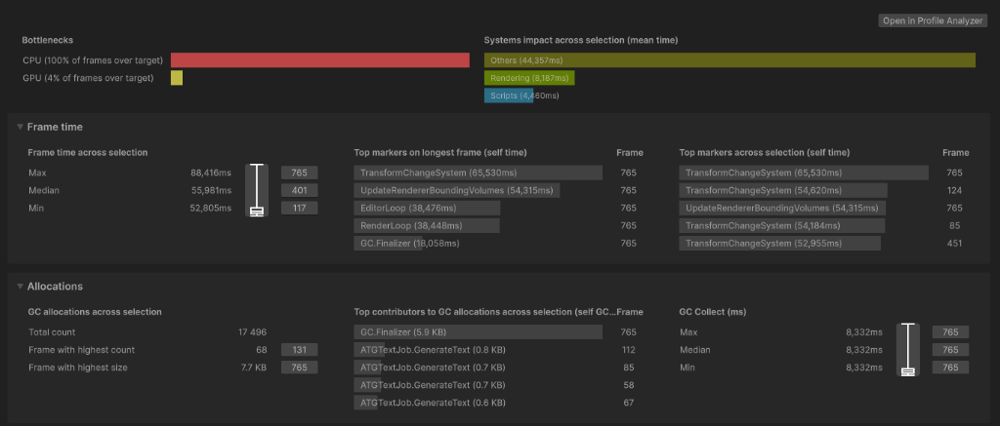 | 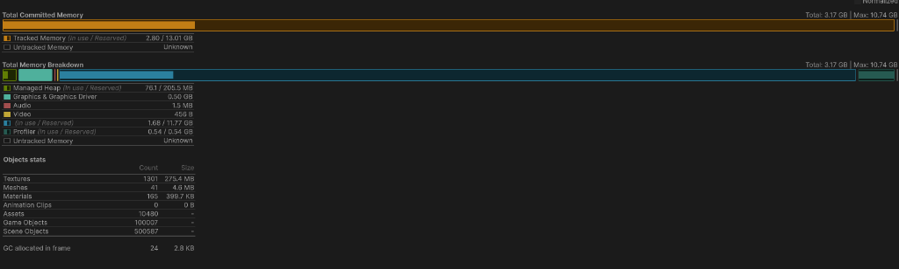 |
| <sub>**B (GO Jobs)**: Standalone 26.0 ms (~38 FPS) \| Editor median: 56.0 ms, Scripts: 4.46 ms</sub> | <sub>Managed Heap: 76.1 MB, Native: 1.68 GB, 100 007 GameObjects (500 587 Scene Objects)</sub> |

| Profile Analyzer (CPU) | Memory Profiler (Memory) |
|:--:|:--:|
| 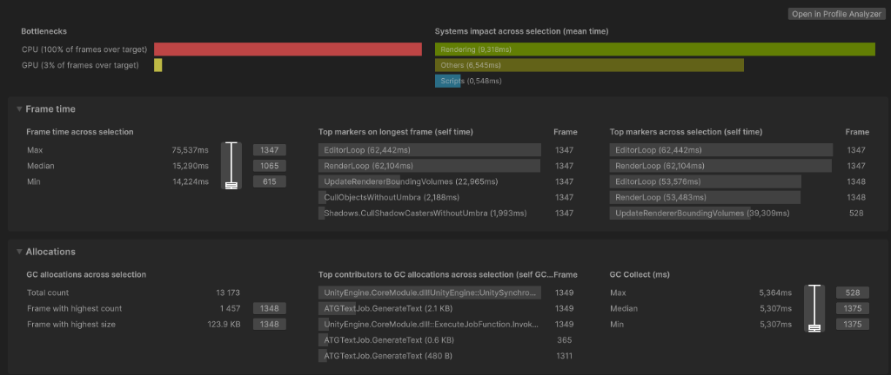 | 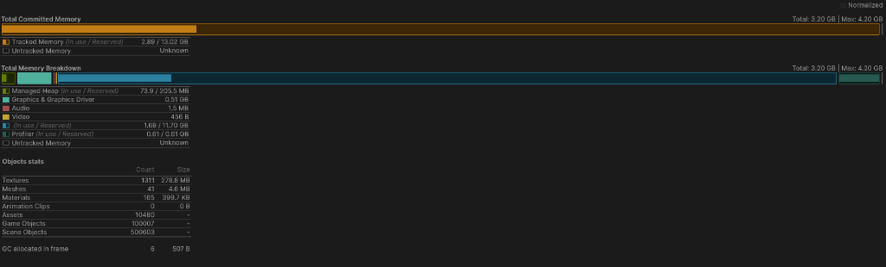 |
| <sub>**C (GO Parent)**: Standalone 8.27 ms (~121 FPS) \| Editor median: 15.3 ms, Scripts: 0.55 ms, BoundingVolumes: 22.97 ms</sub> | <sub>Managed Heap: 73.9 MB, Native: 1.69 GB, 100 007 GameObjects (500 603 Scene Objects)</sub> |

| Profile Analyzer (CPU) | Memory Profiler (Memory) |
|:--:|:--:|
| 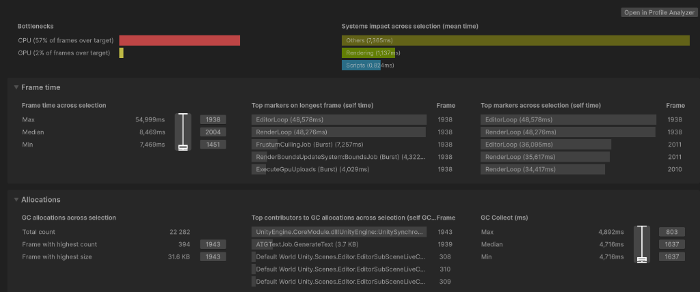 | 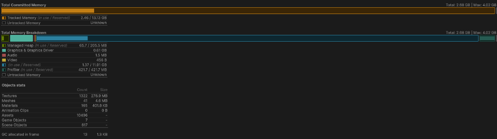 |
| <sub>**D (DOTS Pure ECS)**: Standalone 5.30 ms (~189 FPS) \| Editor median: 8.47 ms, Scripts: 0.82 ms, GPU Uploads: 4.03 ms</sub> | <sub>Managed Heap: 65.7 MB, Native: 1.37 GB, 7 GameObjects total (617 Scene Objects)</sub> |

## Analysis of the results

### 1. Why Common Parent is fastest in No-Render (1.10 ms)
In No-Render mode, moving the common parent took only **1.10 ms** (script execution took 0.55 ms in the Editor profile). The C# code only updates one root transform. Because rendering is disabled, Unity skips calculating world-space transforms and bounding boxes for the 100,000 child objects, leaving their local positions unchanged.

In contrast, DOTS actively updates every entity: the parallel Burst job streams through chunk arrays and rewrites `LocalTransform` components for all 100,000 entities in **1.85 ms** (script execution took 0.82 ms in the Editor profile).

### 2. Why DOTS wins in Render mode (5.30 ms vs 8.27 ms)
When rendering is enabled, the hierarchy advantage disappears:
- In **Variant C (Common Parent)**, Unity must now update the visual bounding volumes of all 100,000 individual `MeshRenderer` components (`UpdateRendererBoundingVolumes` accounts for ~23 ms of cumulative work in the editor profile), raising the standalone frame time to **8.27 ms**.
- In **Variant D (DOTS)**, rendering is handled by the **Entities Graphics** package. Instead of managing 100,000 separate `MeshRenderer` components, it processes culling and draw commands in parallel Burst jobs (`FrustumCullingJob`, `ExecuteGpuUploads`) without GameObject hierarchy overhead, keeping the frame time down to **5.30 ms (~188.8 FPS)**.

### 3. Memory footprint and scene objects
- Classic GameObjects (Variants A, B, C) instantiate **100,007 GameObjects** and allocate over **500,000 native C++ scene objects** (Transform, MeshFilter, MeshRenderer), requiring roughly **1.65 – 1.69 GB** of native engine memory in the editor.
- DOTS requires only **7 GameObjects** and **617 Scene Objects** total, saving over **300 MB** of native engine memory.

---

## Limitations and design decisions

### Limitations:
- **Study 1** evaluates two distinct algorithmic solutions (Box2D contact solver vs Spatial Hash separation) rather than isolating engine runtime overhead alone.
- In **Study 1**, GameObjects were not benchmarked at 50k and 100k because 10k entities already approached the 60 FPS limit (13.60 ms median, 18.40 ms p99).
- **Study 2** focused on a single high-stress baseline of 100,000 entities to evaluate system behavior under heavy load.
- All numbers reflect a single reference machine (i5-8400, GTX 1660 SUPER, Direct3D 11).

<details>
<summary><b>Design decisions</b></summary>

- **Per-frame spatial hash rebuild (Study 1):** Rebuilding the `NativeParallelMultiHashMap` from scratch each frame in parallel was simpler to implement and parallelizes cleanly across worker threads without complex cell-migration tracking.
- **2D vs 3D hash search (Study 1):** Since movement is planar (Z = 0), reducing neighbor search from 27 cells to 9 reduced 100k frame time from 35.68 ms to 11.23 ms in Render mode (3.2x faster) and from 33.26 ms to 8.18 ms in No-Render mode (4.1x faster).
- **TransformAccessArray for Jobs (Study 2):** In Variant B, `IJobParallelForTransform` allowed updating GameObject transforms across worker threads, eliminating the overhead of 100,000 individual MonoBehaviour `Update()` calls.
- **Chunk-based IJobEntity (Study 2):** In Variant D, `IJobEntity` was scheduled with `ScheduleParallel()` to iterate over contiguous entity chunks with Burst compiler vectorization.

</details>

---

## Quick start

**Requirements:** Unity `6000.6.3f1`, Entities `6.6.0` (see `Packages/manifest.json`).

```bash
git clone https://github.com/Checoffix/dots-swarm-benchmark.git
```

1. Open the project in Unity Hub.
2. Open the scene for the study you want to run:
   - **Study 1 (DOTS):** `Assets/Scenes/Study1/DOTS_Scene.unity` (with subscene `HordeSubScene.unity`)
   - **Study 1 (GameObjects):** `Assets/Scenes/Study1/GO_Scene.unity`
   - **Study 2 (DOTS):** `Assets/Scenes/Study2/DOTS_Scene.unity` (with subscene `HordeSubScene.unity`)
   - **Study 2 (GameObjects):** `Assets/Scenes/Study2/GO_Scene.unity`
3. Press **Play** to run in Editor, or build standalone (**File → Build Settings → Build**) to log frame times with `FrameTimeLogger`.

## About

Project by [Checoffix](https://github.com/Checoffix).
